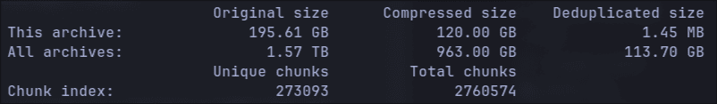

I hope this article helps anyone having issues with Duplicity that would open to trying out some of its more modern alternatives.

When I first setup my Homelab around a old tower PC running TrueNAS Scale in 2023 I was ecstatic about the all the different things I could use it for. Chief among them being that I could try out this cool backup tool called [Duplicity](https://Duplicity.us/) that I was told about in a Linux IT class. The instructor, a kind bearded fellow, truly every stereotype of a Linux admin boiled into one regaled how this tool could perform incremental backups and upload to even untrusted computers by encrypting the backups sent. To be exact, Duplicity uses the same tech as rsync to first make a full backup of the system followed by incremental backups that reference the previous backups. I thought the idea of sending only the data that changed in a snapshot was really cool for its speed and storage savings. Unfortunately, not having an extra computer at the time to use for backups prevented me from really pursuing it then.

## Digging Myself Into a Hole

With my NAS running and an NFS share setup to a Debian VM I finally could see what this backup tool could do. On my main laptop at the time I was using NixOS (*Shudders in terror*) so I used the `services.duplicity` ([API](https://search.nixos.org/options?channel=25.05&query=Duplicity)) module which setups up systemd service for automatically running Duplicity backups. As far as anything Nix goes it went well and I had configured the service for daily backups. I could finally sit back in my chair satisfied that I was efficiently utilizing my new NAS with automatic incremental backups.

Something I did notice that was odd was that this NixOS module didn't allow you to create an arbitrary number of distinct Duplicity instances pointed to different root paths, just the one. So using the little Nix I knew I scrapped together my own bespoke module based on the original that could create multiple systemd services for distinct Duplicity jobs. Finally, once again, I could rest easy knowing that if in the future I needed distinct jobs I could ust this module to quickly add them.

Then I actually used my laptop for some time and I noticed something. It was slow, I even tried using the experimental parallel uploads feature to no avail and exhausted all of the performance flags I could find. This was all despite my internet being more than fast enough to rsync or scp my files to my server without issue. Furthermore, whatever feature that allowed Duplicity to resume incomplete backups, like say if I put my laptop to sleep as you do on the regular seemed to not be working that well. I wouldn't be shocked if this was a NixOS issue somehow. The bottom line was that between those two issues in the span of a month I couldn't even finish the initial full upload Duplicity required before it could start using smaller incremental backups.

To make matters worse I had a realization, while its configurable how often Duplicity does a full backups **if you ever want to delete backups then you need to perform another full backup for the future incremental backups to then reference**. Which means that I would need to do a full system backup at least somewhat regularly and I couldn't seem to get it to happen once. After seeing this I gave up for the time being.

## Digging Myself Into a Deeper Hole

At some point, I had started reading about this tool called [IPFS (Inter Planetary File System)](https://ipfs.tech/). Crypto web 3 nonsense aside I thought the tech was really cool. The TLDR is its a torrent like system for hosting data from peer to peer utilizing git object style storage in 256kb chunks. If you don't know, git objects are stored using one big global namespace populated with the hash of each file, folder, etc, within it (see below). These hashes then can be used to address data uniquely and verify its integrity. Within this storage style you also have the option to keep files as intact chunks like git does, or split them up like IFPS which needs to break up larger files so that chunks stay within a 256kb chunk size. Whats cool about storing data in these hashed chunks is that it automatically de-duplicates files and data within files (in the case of IPFS) because if **two chunks have the same hash then we only need one of them.**

````txt
> tree .git/objects/
.git/objects/
├── 00
│   └── 08ddfb587d55e9a126564eae4066a390475d54
├── 01
│   ├── 04d07c5d207cdb581f220b8f4af81447ead945
│   └── 7ee0f86b3058de597e3a4b83ab1694b8eebe9a
├── 03
│   ├── 9742ff5981144adfaf76cbd493fc2a0f014dc9
│   └── df00d989e539839f4f0e81e79144ecd4036f7d
├── 04
│   └── 14d94ad9de029a05a4501a1e373fee6d5d672a
├── 05
│   ├── 17c7ce5922c2ae8725a401796c0508bf160b33
.....
````

After reading up on this I thought this would make for a really good backup technology. It would de-duplicate just like Duplicity but in a much less rigid way because a backup would be made of many individual chunks as apposed to one giant blob of everything. This means that **instead of needing to delete the entire full backup when you want to free up storage on the backup server you could just delete ONLY the individual chunks that are no longer needed** while keeping the rest.

So I created PodVault, a quick and dirty Python implementation that could split a target folder and its files recursively into chunks and upload them over ssh to a chunk based storage folder. It mostly worked but would need a lot more unit tests, refactoring, and caching before I could really rely on it. As a proof of concept though, it was a fun challenge take on with my limited free time. I walked away thinking that this style of storage would definitely make for a great backup system. Its just a shame (\*sighs in retrospect\*), no one had already created a tool that uses this storage style for de-duplicating backups already :)

Once again I created a small NixOS module that would let me create a systemd service for it:

````nix
{
	enable = true;
	instance."podvault-test" = {
		targetUrl = "scp:username@host:/mnt/nfs/backups/test";
		root = "/home/USER/";
		user = "USER"; # use the ssh keys of this user
		exclude = homeExcludes "USER";
	};
}
````

## Enlightenment

At this point, years had gone by with me not having a working automatic backup system and somehow I never once researched alternative tools to Duplicity. A tool, that first released in 2002, and frankly, thats on me. It turns out that since 2002, most people has moved on. Duplicity still exists and I'm sure works great for some people especially if they don't have that much data but compared to the modern alternatives its been left in the dust feature wise.

After stumbling upon some comments mentioning alternatives to Duplicity while doing some upgrades to my Homelab, here are the two most established backup tools I could find that fill Duplicity's niche. Both of these tools have the same base capabilities like encryption, incremental snapshots, and compression of Duplicity but improve upon it several cool ways. This isn't an exhaustive list or comparison of these two tools, I'm just pointing out that either of these tools are awesome coming from Duplicity:

* [Restic](https://restic.net/)
* [Borg](https://www.borgbackup.org/)

Features found in both:

* **Better Data De-Duplication** - Data duplication is done in more individual chunks just like my PodVault, eliminating the need to re-upload full backups to delete data like Duplicity. ([Borg Chunks](https://restic.readthedocs.io/en/latest/100_references.html#backups-and-deduplication), [Restic Chunks](https://github.com/borgbackup/borg?tab=readme-ov-file#main-features))
* **Mounting Backups** - You can mount backups allowing you to browse and restore files even with a regular graphical file manager. I love this!!
* **Repository Server Options** - Optionally, you can install a server version of the backup software ([Borg Server](https://github.com/restic/rest-server), [Restic Server](https://borgbackup.readthedocs.io/en/stable/usage/serve.html))  to unlock more functionality like `append-only` repositories so if an attacker breaches your main computer they can't remotely delete your backups.
* **Multi-Client Support** - Multiple computers can upload data to the same backup repository allowing de-duplication between computer backups! This of course is only useful if you have similar files on both but is still very cool.

Also special mention that Restic even supports Windows and is being used by [CERN](https://forum.restic.net/t/restic-in-cern-slides-on-fosdem24/7253) apparently.

## Sweet Success

::: {.row}

::: {.col-xl-6}
For me, naturally I had to choose Borg because \*cough\* resistance is futile.

As for setting it up, I was pleasantly surprised to see that both the nix modules for BorgBackup and Restic support creating multiple instances/systemd services so I think the reason the Duplicity' module doesn't have that is probably due to the lack of interest in it. Once again after the regular NixOS shenanigans like the only [examples](https://nixos.wiki/wiki/Borg_backup) I could find being broken I finally have working automatic backups to my NAS. If you've never had the pleasure of using one of these tools check out my stats in show below. Across all snapshots my repository is only 113GB and the latest one added just 1.45MB to the repository because only a few files have changed since yesterday.
:::

::: {.col-xl-6}



:::
:::

Here is the jist of my config with the hacks I had to do:

````nix
services.borgbackup.jobs."home-${myUser}" = rec {
	paths = "/home/${myUser}";

	# set the ssh private key for sshing to our repo without password
	# @TODO this is the recommended way in the examples but it doesn't work???
	#environment.BORG_RSH = "ssh -i /home/${myUser}/.ssh/id_ed25519";
	user = myUser; # work around for now

	# set repo password
	encryption.passCommand = "cat /path/to/passphrase_file";

	repo = borgRepo;
	encryption.mode = "repokey";
	compression = "auto,zstd,3";
	startAt = "daily";

	patterns = home-patterns;

	# change snapshot args
	extraCreateArgs = [
		# make verbose so you can see its actually working with "journalctl -u borgbackup-job-home-USER.service -f"
		"--stats"
		"--info"
		#"--list" # view logs of files/folders found 'x' means file was excluded https://borgbackup.readthedocs.io/en/stable/usage/create.html#item-flags
		"--checkpoint-interval=600" # The example in the wiki is wrong. You must use the = syntax instead of space or is crashes??
	];

	# for docs run: borg help prune
	prune.keep = {
		within = "1d"; 
		daily = 1; 
		weekly = 3;
		monthly = -1;  # Keep at least one archive for each month
	};
};
````

I hope you enjoyed this journey exploring de-duplicating backup tools for Linux. Despite forgetting to do my research for years, I ultimately learned a lot more about what goes into designing one of these tools because it gave me an excuse to write a proof of concept one myself. Duplicity may have pioneered some features back in the day, but it has mighty competition that I would greatly recommend over it at this point.

Have a great day and remember to backup your computer regardless of what tool you pick.
