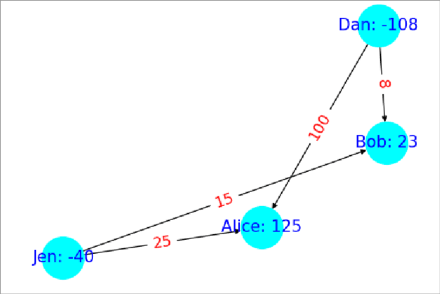
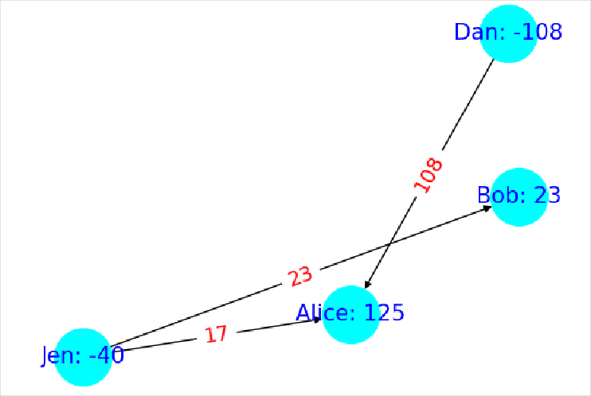

\#let n = 1000000
\#let e = (n * (n - 1))/2

Say you have $n = 1000000$ roomates. You all live happily together and occasionally lend money to one another forming a directed graph of at most $e = mat(n; 2) = #{e}$ edges of money owed. A year goes by and suddenly, there is a problem (just one). How do you resolve the money owed between these $n$ roommates under the constraints that one roommate can only payout to another if they initially owed that person money and there must be  $<= n - 1$ payments in total to resolve all debt?

These constraints rule out the trivial answer to have all owers payout into a single cash pool that is then redistributed to anyone who is owed money.

An algorithm that does meet these criteria is as follows: Start by finding an undirected cycle in the graph of money owed (Ex: @img:before). Next, find the edge with the smallest amount owed along that cycle. Now, subtract or add (depending on edge directions in the cycle) that edge weight around the cycle (Ex: @img:after). This includes subtracting it from itself and we delete all edges with weight zero so we always delete the smallest edge. The rational for this is that *we are passing the money owed within that edge around the cycle the long way so the debt is still paid.* All thats left to do is just run this procedure over and over until no undirected cycles can be found. If no cycles can be found then that means we are left with a most a spanning tree which by definition has at most $n-1$ edges so we have met the second requirement. As for the first requirement, this algorithm only deletes edges from the original graph so it is also met.

::: {.row}

::: {.col-xl-6}

:::

::: {.col-xl-6}

:::

:::

In my testing this algorithm could find the solution to an 800 node graph with ~300k edges in 21 minutes on a modern computer in 2025. However, that graph size isn't any where close to $n = 1,000,000$ and that eye watering $#{e}$ edges so how can we go faster?

# Scaling to a High Performance Compute Cluster

It turns out that parallelizing this algorithm is pretty simple as long as we do it on unique subsets of edges so that one process is not mutating the same data as another. As for picking out these subgraphs, I opted for a fast heuristic of taking a random node and then breadth first spreading around it (once again treating the directed graph as undirected) until I hit the number of edges I wanted in that subgraph. This lets us quickly find subgraphs of roughly equal edge count that might have cycles within them for our algorithm to prune. From what I've observed this works enough on random graphs (Using Erdős-Rényi's algorithm) that the solved subgraphs will often have already removed enough edges that there isn't any work to be done on the final merged graph.

So we can parallelize it, but will that be enough? The most basic form of scaling an algorithm on a computer is to use multiple threads or processes to take advantage of multiple CPU Logical Processors but this is *limiting because the largest CPU today is only [256 Cores](https://ir.amd.com/news-events/press-releases/detail/1219/amd-launches-5th-gen-amd-epyc-cpus-maintaining-leadership-performance-and-features-for-the-modern-data-center) (Hyprthreading makes that 512 Logical Processors).* If we really want to scale up we need to utilize multiple computers.

Introducing, HPC (High Performance Computing). HPC is a catchall term for aggregate compute systems like data centers and after getting access to MSU's HPC Cluster for a course I had exactly what I needed. To implement the algorithm I wrote a Python program that uses the subgraph heuristic to paralyze using both the normal `multiprocessing` library for paralyzing across processes and [MPI (Message Passing Interface)](https://hpc-wiki.info/hpc/MPI). MPI works similar to `multiprocessing` but it lets you scale your program across multiple nodes/computers within an HPC Cluster.

= Results
Using a random graph with 800 nodes with edge probability of 0.9 between each node pair resulting in 313,655 edges I collected the following stats.

|Type|Logical Processors used in Parallel|Time|
|----|-----------------------------------|----|
|MPI&Multiprocessing(nodes=5+1, procs=16)|80|1m3.666s|
|Multiprocessing(procs=64)|64|1m11.418s|
|MPI&Multiprocessing(nodes=5+1, procs=8)|40|1m17.025s|
|Multiprocessing(procs=32)|32|1m19.702s|
|MPI(nodes=5+1)|5|2m55.098s|
|Single Process|1|21m5.739s|

 > 
 > \[!NOTE\] Note on Syntax
 > I used `nodes = # workers + 1 root` because the root node wasn't doing anything during the subgraph parallelism portion. This is to make it more comparable with multiprocessing which always has a +1 process acting as its root too, it just doesn't lock up an entire process like it does in MPI. Also I'm using "procs" synonymously with logical processors because I am allocating one process via `multiprocessing` for ever logical processor.

What's exciting about this data is that after sorting by logical processor count, the Type column alternates between tests with MPI or using plain procs all the while time decreases the larger the logical processor count. This indicates that MPI isn't introducing a lot of overhead compared to using more processes on the same machine which further suggests that on larger graphs like $n = 1000000$ where you need more processes than you can have on 1 computer, *using MPI too attain more logical processors by spanning across multiple nodes in the cluster looks very viable*.

I also tried more procs but it just runs slower because the created subgraphs eventually become so small that they don't contain many cycles to prune leading to eventually more single process like performance. So for this graph about ~65 seconds is as fast as we can go on these computers.

* `Multiprocessing(procs=128 so 128 lp): 2m0.817s`
* `MPI&Multiprocessing(nodes=5+1, procs=24, so 120 lp): 1m8.499s`

So what about $1000000$ roomates?

Unfortunately, I couldn't get close to it because of the *ram limitations on my HPC account* which would force the use of swap space slowing everything down too much. The largest graph I got to work was only a $1,102,970$ edge graph I ran on 5+1 nodes each with 5 Gigs of memory and 32 procs (so 192 procs in total) that finished in 5m35.914s. This is a 3.5x increase in the number of edges from the previous graph. I could always create a graph with a million roommates but not with anywhere close to 1000000 edges which is where the real meat and potatoes is. I'd imagine you would need to sequester the entire MSU HPC cluster just to start putting a dent into such a min-boggling large number of edges.

That concludes this journey into paralyzing algorithms in an HPC Cluster. In it, we learned about problems like resolving payments between a million people and how we could reduce the number of payments by pruning edges in undirected cycles. We then used a heuristic to split the problem into unique subgraphs so we could paralyze the processing of it. Finally, we used MPI to scale it across nodes in a HPC Cluster unlocking access to more logical processors than any one computer could contain. The results indicate that this problem scales well across nodes so with a large enough cluster we can keep scaling the algorithm in parallel up to the point of diminishing returns from the subgraphs being too small to be useful.

I hope you enjoyed this writeup and learned a thing or two!

Happy a great day.
