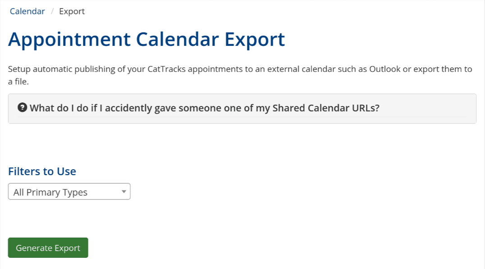
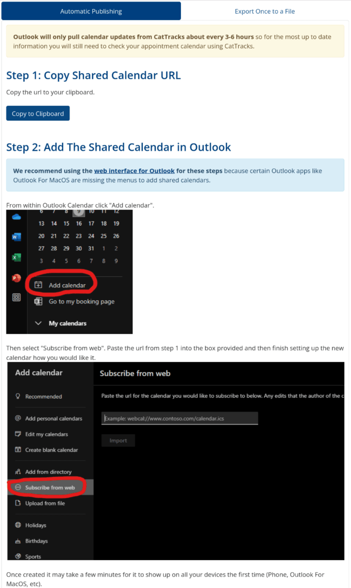

## The Problem

The MSU CatTracks website is run by the
[AYCSS](https://www.montana.edu/careers/) and amongst many things houses
an appointment system. This system is used by everyone from student
class tutors to career coaches for hosting appointments that students
can then sign up for on the website. However, since these appointments
are only within CatTracks it means that in practice employees creating
appointments have to juggle both Outlook calendar which contains the
rest of their busy schedules and the CatTracks website calendar which
only has appointments.

To remedy this I researched and devised a way to create a unique url
that would return an iCalendar file exports of a person's appointments.
Outlook supports adding urls that return iCalendar files as way to
automatically sync calendar data into Outlook.

What was left then, was creating a UI/UX for employees to create new
syncing urls that they can add to their Outlook.

# Discovery Processes

## 1. Initial Prototype and Research

I first layed out what I thought could work as a prototype and started
building out the basic functionality.

During this time I would occasionally have an idea of how something
could be expanded on to be useful. Before implementing it though, I
would ask one of the affected employees if they thought they would
actually use it. One such example was the idea to allow creating
multiple syncing urls with attached filters. This would be useful to
employees with many types of appointments that might want to have them
color coded differently within Outlook which they agreed would be nice
to have so I added it.

For adding the appointment filters I actually used an identical UI for
appointment filtering to another place on the website so users have an
easier time using it.

## 2. User Testing

After getting a minimum viable product working I tried it on an employee
to see how well it fared. This was extremely useful because it revealed
several issues with the feature.

* Many AYCSS employees use Macs and the accompanying Mac Outlook App.
  It turns out the Mac Outlook App is missing the button to add the
  syncing url so I added into the instructions a warning that the Mac
  App won't work for adding the url and recommend the use of the web
  version of Outlook which does have the button.
* The url generation would always break the first time requiring a
  page reload to get it working again. This was an easy fix to the
  backend code.

With the above fixes applied and the last pieces of functionality added
to the page this new feature was successfully deployed. Provided below
are some screenshots of the final page.

::: {.row}

::: {.col-xl-6}

:::
::: {.col-xl-6}

:::

:::
