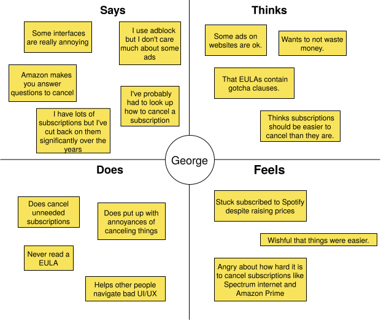
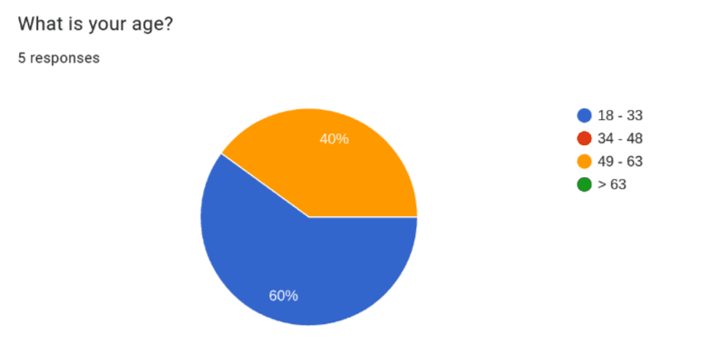
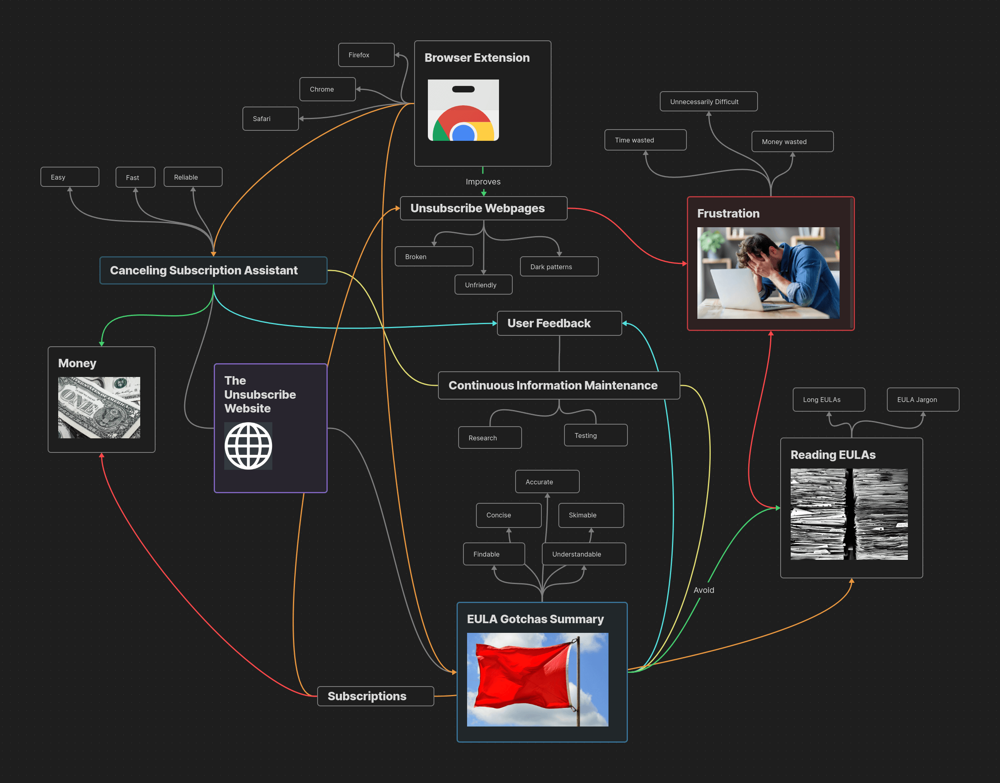
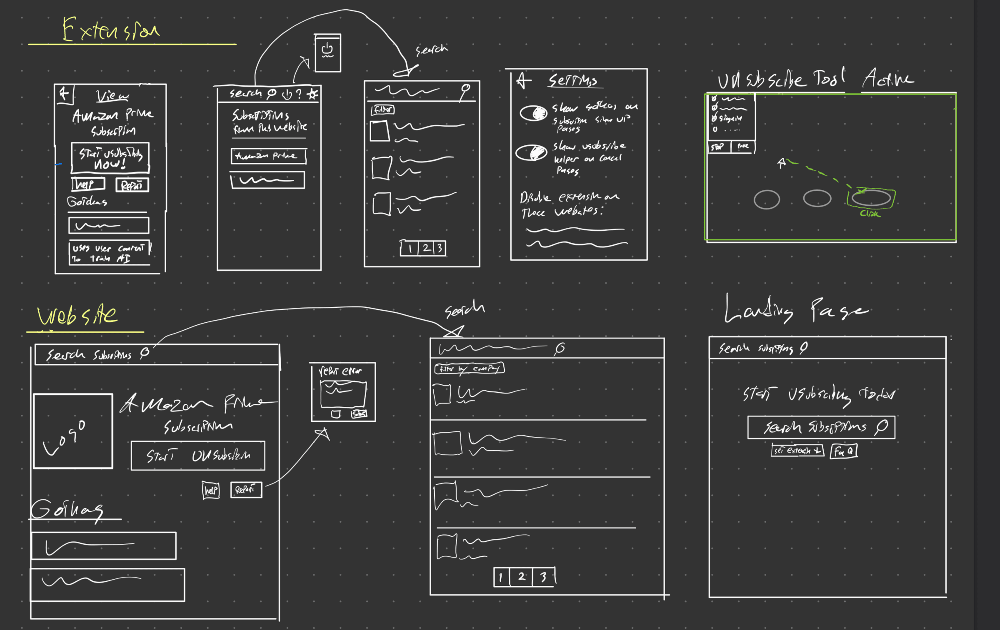
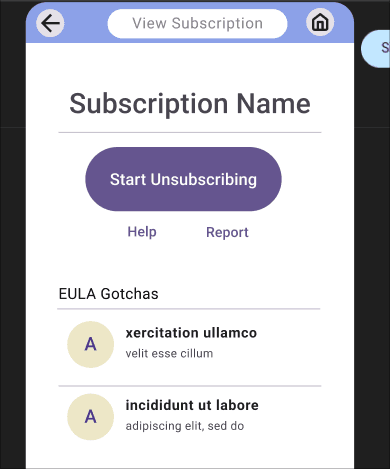
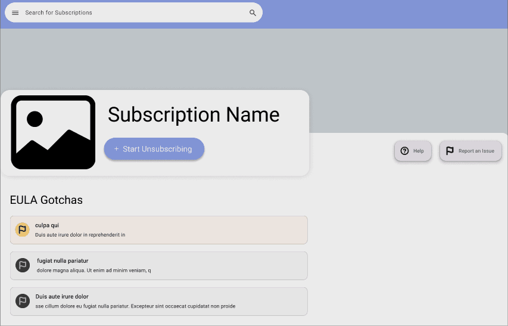

## The Problem

Every day consumers are on the front lines against antagonistic UX designed to make it a challenging as possible to cancel subscriptions and put in the unreasonable position to decipher the gotchas of lengthy EULAs (End User License Agreement). As part of a college UI/UX design project I designed a website and accompanying extension to warn users about large gotchas in EULAs as well as walk you through unsubscribing.

Below is a summary of the process but you can also checkout the [full report here!](./full/)

# Discovery Processes

## 1. Surveys

::: {.grid}

::: {.col-xl-6}
Before designing the app, I interviewed 5 people and created empathy maps to gain a better understanding of users needs. This helped me realize the need for speed which brought about the inception of the accompanying browser extension which would allow users to unsubscribe blazing fast by simply pointing them to the next button to click.
:::
::: {.col-xl-6}

:::

:::

## 2. Ideation

::: {.grid}

::: {.col-xl-6}
Armed with empathy maps and personas I brainstormed all of the elements my app had and how they are related. This useful to get all of the features and concerns out on paper so problems like missing functionality implied by other features isn't missed. I used a mind map for this process because it emulates how humans think.
:::
::: {.col-xl-6}

:::

:::

## 3. Low Fidelity Prototyping

::: {.grid}

::: {.col-xl-6}
I then started sketching out possible UIs that would fulfill the ideas I came up with. Importantly, this step is still very ruff allowing for easy adjustment and refinement as I develop how this app could look and function. During this step I also began to use various UX laws like Fitts Law and the Nielsen Useability Heuristics to create more affective UX.
:::
::: {.col-xl-6}

:::

:::

## 4. High Fidelity Prototyping

::: {.grid}

::: {.col-xl-6}
After getting a pretty good of how things could work using low fidelity prototyping I built a interactive prototype using Figma. This step is crucial to assist with user #lorem(10) as well as ensure the user experience through the app makes sense. Once such mistake I caught was that it was difficult to go back to the extension home from the page viewing an extension so I added a home button for easier navigation.
:::
::: {.col-xl-6}
You can checkout the interactive prototype below:

* [The Unsubscribe Website](https://www.figma.com/proto/4uFmT7quSmFAXhwhCs7ORn/csci443?node-id=1-3&node-type=canvas&t=pHQ5Of9pPDP0c5KP-1&scaling=scale-down&content-scaling=fixed&page-id=0%3A1&starting-point-node-id=1%3A3)
* [The Extension](https://www.figma.com/proto/4uFmT7quSmFAXhwhCs7ORn/csci443?node-id=18-9395&node-type=frame&t=xHUKJaHaw1HolPii-1&scaling=scale-down&content-scaling=fixed&page-id=0%3A1&starting-point-node-id=1%3A3)
* [The Entire Figma Project Itself](https://www.figma.com/design/4uFmT7quSmFAXhwhCs7ORn/csci443?node-id=0-1&t=uZs2Ze2bVvSAHGIs-1)
  :::

:::

,
,

Checkout the [full report for this project here!](./full/)
